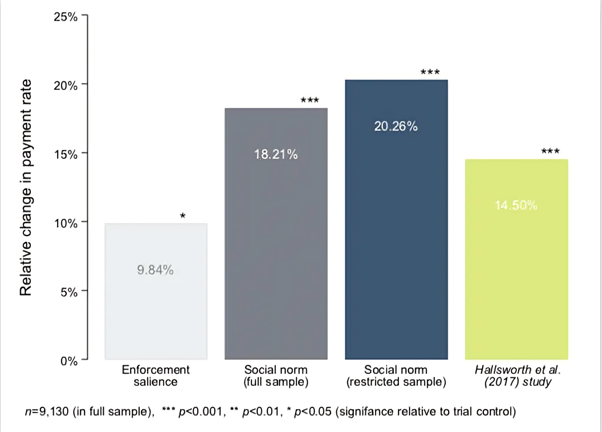



_This article was originally published in 2016 on the Policy Insitute at King's College London's blog. See [here](https://www.kcl.ac.uk/news/nudges-might-be-more-effective-closer-to-home) for original._

Much has been made of the rise of behavioural science as a tool widely used by governments. It began with Cass Sunstein’s role as Administrator of the Office of Information and Regulatory Affairs (OIRA) in the Obama administration and continued with the Conservative/Lib Dem coalition government’s establishment in 2010 of the Behavioural Insights Team - the world’s first nudge unit. A model which has now been adopted in over 50 countries.

Despite the diversity of the work done by government units applying behavioural science, one common starting point for many teams is in the domain of taxation, and principally - getting people to pay promptly. This suite of experiments has had results that range from [the impressive](https://ideas.repec.org/a/eee/pubeco/v148y2017icp14-31.html) (raising millions of extra pounds), to [the surprising](https://www.bi.team/publications/behavioral-interventions-in-tax-compliance-evidence-from-guatemala/) (interventions that are effective in the UK also work in Guatemala), to [the completely unimpressive](https://www.bi.team/publications/failure-to-captcha-attention-null-results-from-an-honesty-priming-experiment-in-guatemala/) (a study on millions of people found that none of the six interventions tested had any effect).

Earlier this month, we published a paper in the Journal of Behavioral Public Administration based on an experiment we conducted a few years ago, when we both worked in the Behavioural Insight Team. We, together with our colleagues Isabelle Andresen and Felicity Algate, ran a field experiment with Medway local authority, which tested three different versions of a reminder letter for people who were a bit late paying their council tax - the main source of revenue for local governments.

Over the course of three payment periods, late-payers received different letters. The first was the council’s "business as usual" letter reminding them to pay out. The second, drew attention to the council’s enforcement process, highlighting that the recipient was on the road towards a fine. The final letter what behavioural scientists call “social norms”, taking advantage of our desire to do what we see others around us doing, addressing the recipient stating that “_96% of Medway Council Tax is paid promptly. You are currently in the very small minority of people who have not paid on time_" .

We found that both of the new “behavioural” letters significantly outperformed the control, boosting repayment rates by more than 10%. The results of the social norms message were particularly effective, however, increasing repayments by more than double the effect of the “enforcement” message.

What was particularly interesting to us, however, is that the effect of the norms intervention was substantially larger than had been seen in other, similar studies - particularly those carried out by our colleague Michael Hallsworth in collaboration with HMRC. We wanted to understand why, and quickly arrived at a few possibilities. First, it could be that the amounts were different in our study, and so people were easier to nudge when there was less at stake.

Alternatively, there could be something about the _local_ tax interacting with the social norm. Hallsworth himself had found that by making the _social norm_ more local - by saying “nine out of 10 people in Oxford have already paid their tax” he was able to get better results than by saying “Nine out of 10 people in the UK have already paid their tax”.

What we were looking for here, was whether or not the localness of the tax - a council tax payment that would only help people in your area - made the same intervention more effective than a national social norm, where the benefits are more diffuse.

To investigate this, we cut our data to make it as similar as we could to Hallsworth’s original study - by removing the very high and very low debts at the top and bottom. We ended up with a group of households that were in our study, but which had the same average debt - and the same variety of debts - as in the other study. When we analysed the effects of our interventions for that cohort, the effect of the social norms intervention jumped again - this time to 14.05%.

If the differences in the two groups were driving the disparity in the results, we would have expected the opposite to happen. This means that, there is indicative - although not conclusive - evidence that when it comes to tax compliance, people really do care about keeping up with the other people in the local area, and their own communities.